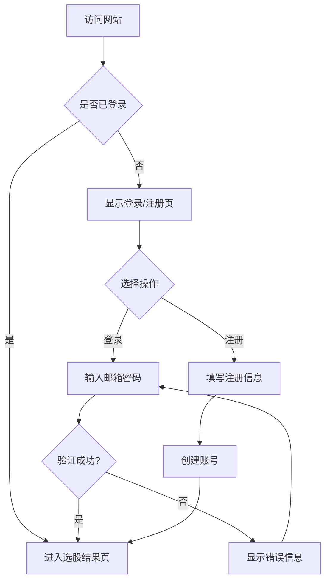
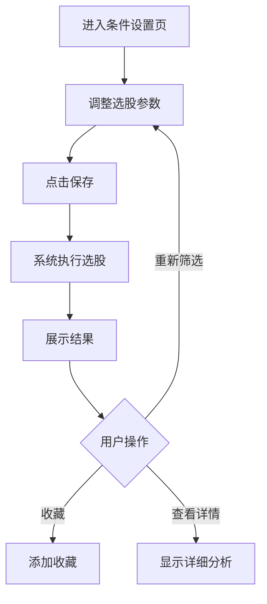

# 选股系统Web平台 - 产品需求文档

## 1. 产品概述

智能选股系统Web平台是一款面向个人投资者的股票筛选工具，基于技术面和基本面分析帮助用户发现优质投资标的。

- **核心目的**：简化选股流程，通过预设的技术指标和财务条件自动筛选符合条件的股票
- **目标用户**：个人投资者、散户、价值投资者
- **市场价值**：降低投资研究门槛，提高选股效率

## 2. 核心功能

### 2.1 用户角色

| 角色 | 注册方式 | 核心权限 |
|------|---------|---------|
| 普通用户 | 邮箱注册/登录 | 查看选股结果、修改个人选股条件、收藏股票 |
| 管理员 | 系统预设 | 管理用户、调整系统默认选股条件 |

### 2.2 功能模块

1. **首页/选股结果页**：展示当前选股条件下的筛选结果
2. **登录/注册页**：用户账号管理
3. **条件设置页**：自定义选股参数
4. **用户中心**：个人信息管理

### 2.3 页面详情

| 页面名称 | 模块名称 | 功能描述 |
|---------|---------|---------|
| 登录/注册页 | 账号登录 | 邮箱+密码登录 |
| 登录/注册页 | 用户注册 | 邮箱+密码注册 |
| 选股结果页 | 股票列表 | 展示筛选出的股票及其关键指标 |
| 选股结果页 | 股票详情 | 显示单只股票的详细分析数据 |
| 条件设置页 | 技术指标设置 | 调整盘振天数、振幅阈值、筹码集中度等 |
| 条件设置页 | 基本面设置 | 调整净利润、流通股、持续盈利年限等 |
| 用户中心 | 个人信息 | 显示用户信息、修改密码 |
| 用户中心 | 收藏管理 | 管理收藏的股票 |

## 3. 核心流程

### 3.1 用户登录流程

### 3.2 选股流程

## 4. 用户界面设计

### 4.1 设计风格

- **主色调**：深蓝色 #1a365d（专业、可信）
- **强调色**：金色 #d69e2e（财富、成功）
- **背景色**：深灰 #1a202c（现代、金融感）
- **文字色**：白色 #ffffff、灰色 #a0aec0
- **按钮风格**：圆角按钮，带hover渐变效果
- **字体**：思源黑体（中文）、Roboto（英文）
- **布局风格**：卡片式布局，侧边导航栏

### 4.2 页面设计概览

| 页面名称 | 模块名称 | UI元素 |
|---------|---------|--------|
| 登录页 | 登录表单 | 输入框、按钮、背景渐变 |
| 注册页 | 注册表单 | 输入框、密码确认、按钮 |
| 选股结果页 | 股票表格 | 可排序列表、股票代码/名称/价格/涨跌幅 |
| 选股结果页 | 筛选器 | 下拉选择、复选框、搜索框 |
| 条件设置页 | 参数表单 | 滑块、输入框、保存按钮 |
| 用户中心 | 信息卡片 | 头像、用户名、编辑按钮 |

### 4.3 响应式设计

- **桌面优先**：1200px以上全功能展示
- **平板适配**：768px-1200px，隐藏侧边栏
- **移动端**：小于768px，底部导航栏

## 5. 数据指标说明

### 5.1 技术面指标

| 指标名称 | 说明 | 默认值 |
|---------|------|--------|
| 盘振天数 | 统计区间天数 | 120天 |
| 最大振幅 | 区间内最高/最低价差百分比 | 15% |
| 筹码集中度 | 成交量加权价格与当前价差 | 30% |

### 5.2 基本面指标

| 指标名称 | 说明 | 默认值 |
|---------|------|--------|
| 最低净利润 | 公司年度净利润门槛 | 5亿元 |
| 最低流通股 | 流通股数量门槛 | 5亿股 |
| 持续盈利年限 | 连续盈利的年数 | 5年 |

## 6. 安全性考虑

- 用户密码加密存储（bcrypt）
- 会话管理（JWT token）
- 防止SQL注入
- 防止XSS攻击
- 敏感操作需要二次验证

## 7. 性能要求

- 页面加载时间 < 3秒
- 选股计算响应时间 < 5秒
- 支持同时在线用户 > 100人
