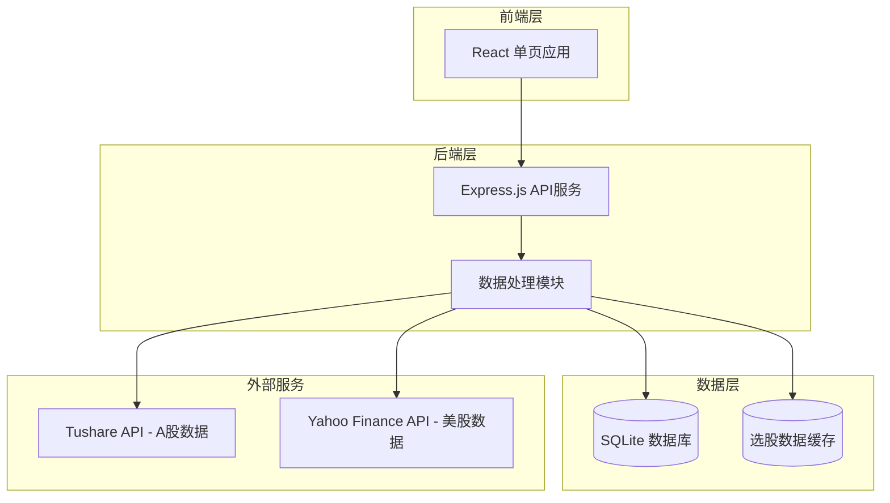
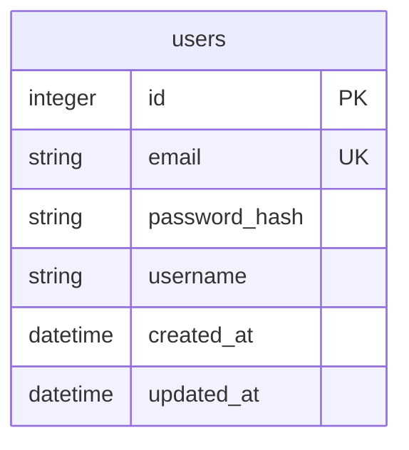
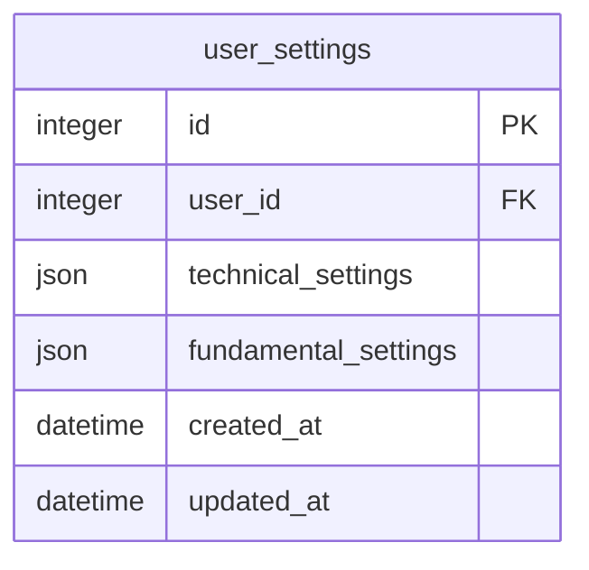
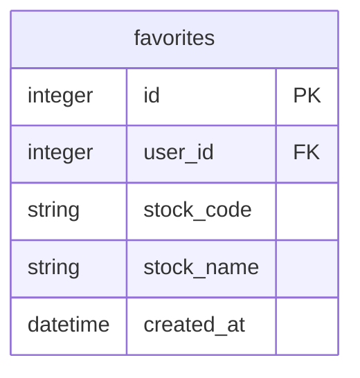

# 选股系统Web平台 - 技术架构文档

## 1. 架构设计



## 2. 技术栈

| 层级 | 技术选型 | 版本 |
|------|---------|------|
| 前端框架 | React | 18.x |
| UI组件库 | TailwindCSS | 3.x |
| 构建工具 | Vite | 5.x |
| 后端框架 | Express.js | 4.x |
| 数据库 | SQLite | 3.x |
| ORM | Sequelize | 6.x |
| 认证方案 | JWT | - |
| 密码加密 | bcrypt | 5.x |

## 3. 路由定义

### 3.1 前端路由

| 路由 | 页面 | 说明 |
|------|------|------|
| / | /login | 默认跳转登录页 |
| /login | 登录页 | 用户登录 |
| /register | 注册页 | 用户注册 |
| /dashboard | 选股结果页 | 展示选股结果（需登录） |
| /settings | 条件设置页 | 修改选股条件（需登录） |
| /profile | 用户中心 | 个人信息管理（需登录） |

### 3.2 API路由

| 路由 | 方法 | 说明 |
|------|------|------|
| /api/auth/register | POST | 用户注册 |
| /api/auth/login | POST | 用户登录 |
| /api/auth/logout | POST | 用户登出 |
| /api/auth/profile | GET | 获取用户信息 |
| /api/stocks | GET | 获取选股结果 |
| /api/stocks | POST | 执行选股筛选 |
| /api/stocks/:code | GET | 获取股票详情 |
| /api/settings | GET | 获取用户选股条件 |
| /api/settings | PUT | 更新选股条件 |
| /api/favorites | GET | 获取收藏列表 |
| /api/favorites | POST | 添加收藏 |
| /api/favorites/:id | DELETE | 删除收藏 |

## 4. API详细定义

### 4.1 认证接口

#### POST /api/auth/register

**请求体：**
```json
{
  "email": "user@example.com",
  "password": "securePassword123",
  "username": "用户名"
}
```

**响应：**
```json
{
  "success": true,
  "data": {
    "userId": 1,
    "email": "user@example.com",
    "username": "用户名"
  }
}
```

#### POST /api/auth/login

**请求体：**
```json
{
  "email": "user@example.com",
  "password": "securePassword123"
}
```

**响应：**
```json
{
  "success": true,
  "data": {
    "token": "jwt_token_here",
    "user": {
      "id": 1,
      "email": "user@example.com",
      "username": "用户名"
    }
  }
}
```

### 4.2 选股接口

#### GET /api/stocks

**响应：**
```json
{
  "success": true,
  "data": {
    "stocks": [
      {
        "code": "600519",
        "name": "贵州茅台",
        "industry": "白酒",
        "price": 1850.00,
        "change": 2.5,
        "amplitude": 0.12,
        "netProfit": 6000000000,
        "isChipConcentrated": true
      }
    ],
    "total": 15,
    "page": 1,
    "pageSize": 20
  }
}
```

#### PUT /api/settings

**请求体：**
```json
{
  "technical": {
    "consolidationDays": 120,
    "maxAmplitude": 0.15,
    "chipConcentration": 0.3
  },
  "fundamental": {
    "minNetProfit": 500000000,
    "minCirculatingShares": 500000000,
    "minProfitYears": 5
  }
}
```

## 5. 数据模型

### 5.1 用户表 (users)



### 5.2 用户设置表 (user_settings)



### 5.3 收藏表 (favorites)



### 5.4 数据库DDL

```sql
-- 用户表
CREATE TABLE users (
    id INTEGER PRIMARY KEY AUTOINCREMENT,
    email VARCHAR(255) UNIQUE NOT NULL,
    password_hash VARCHAR(255) NOT NULL,
    username VARCHAR(100),
    created_at DATETIME DEFAULT CURRENT_TIMESTAMP,
    updated_at DATETIME DEFAULT CURRENT_TIMESTAMP
);

-- 用户设置表
CREATE TABLE user_settings (
    id INTEGER PRIMARY KEY AUTOINCREMENT,
    user_id INTEGER NOT NULL,
    technical_settings TEXT DEFAULT '{}',
    fundamental_settings TEXT DEFAULT '{}',
    created_at DATETIME DEFAULT CURRENT_TIMESTAMP,
    updated_at DATETIME DEFAULT CURRENT_TIMESTAMP,
    FOREIGN KEY (user_id) REFERENCES users(id)
);

-- 收藏表
CREATE TABLE favorites (
    id INTEGER PRIMARY KEY AUTOINCREMENT,
    user_id INTEGER NOT NULL,
    stock_code VARCHAR(20) NOT NULL,
    stock_name VARCHAR(100),
    created_at DATETIME DEFAULT CURRENT_TIMESTAMP,
    FOREIGN KEY (user_id) REFERENCES users(id)
);

-- 创建索引
CREATE INDEX idx_users_email ON users(email);
CREATE INDEX idx_favorites_user ON favorites(user_id);
```

## 6. 项目目录结构

```
seek-gupiao/
├── frontend/                 # 前端项目
│   ├── src/
│   │   ├── components/       # React组件
│   │   ├── pages/            # 页面组件
│   │   ├── hooks/            # 自定义Hooks
│   │   ├── services/         # API服务
│   │   ├── styles/           # 样式文件
│   │   ├── App.jsx           # 主应用组件
│   │   └── main.jsx          # 入口文件
│   ├── index.html
│   ├── package.json
│   └── vite.config.js
├── backend/                   # 后端项目
│   ├── routes/               # 路由
│   ├── controllers/          # 控制器
│   ├── models/              # 数据模型
│   ├── services/            # 业务逻辑
│   ├── middleware/          # 中间件
│   ├── config/              # 配置文件
│   ├── server.js            # 入口文件
│   └── package.json
├── documents/                # 文档
│   ├── PRD.md
│   └── 技术架构.md
├── python/                   # Python选股核心
│   ├── config.py
│   ├── data_fetcher.py
│   ├── technical_analyzer.py
│   ├── fundamental_analyzer.py
│   └── stock_picker.py
└── README.md
```

## 7. 安全措施

- JWT Token有效期设置为24小时
- 密码使用bcrypt加密（cost factor: 10）
- API请求需要Authorization header
- CORS配置限制来源
- 请求频率限制（rate limiting）
- SQL参数化查询防止注入
